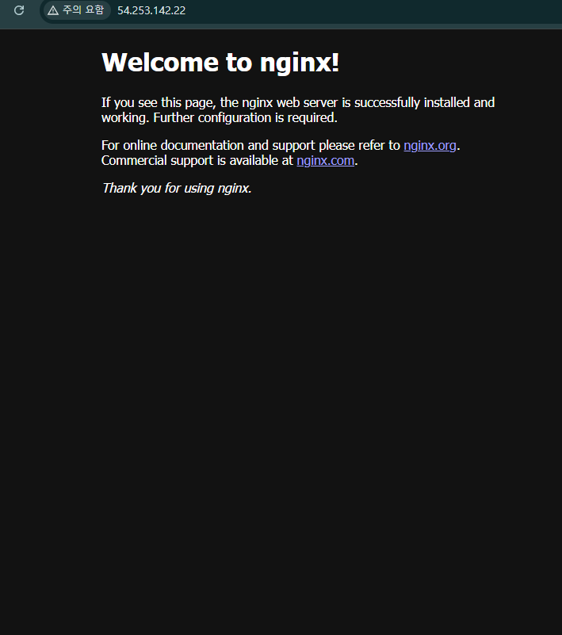

## 1. 문서 개요
```
본 문서는 AWS 웹 서비스 배포 실습 과정을 담고 있습니다.
```

## 2. 아키텍쳐 다이어그램


## 3. 서비스 접속

[http://54.253.142.22/](http://54.253.142.22/)



## 4. 트러블 슈팅

[트러블 슈팅](docs/trouble.md)

## 5. 리소스 정리 체크리스트

[체크리스트](docs/checklist.md)
