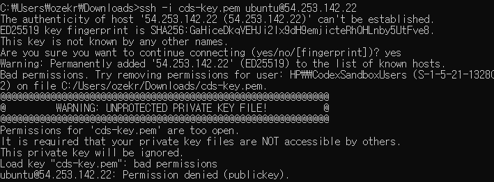
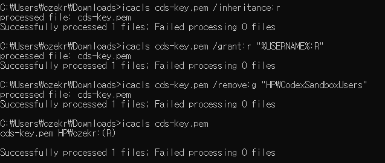
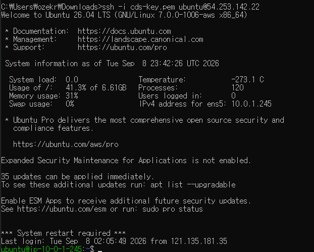

[README로 돌아가기](../README.md#4-트러블-슈팅)

# 트러블슈팅

## SSH 개인키 권한 오류

### 증상

Windows에서 cds-key.pem 파일로 EC2 인스턴스에 SSH 접속을 시도했으나, UNPROTECTED PRIVATE KEY FILE 오류가 발생했습니다. 개인키 파일의 권한이 너무 열려 있어 키가 무시되었고, 접속이 거부되었습니다.

### 원인

오류 메시지에서 HP\CodexSandboxUsers 그룹이 개인키 파일에 접근할 수 있는 상태임을 확인했습니다. 현재 사용자 외의 그룹에 접근 권한이 부여된 것이 원인이었습니다.

### 조치

icacls 명령으로 상속 권한을 제거하고, 현재 사용자에게 읽기 권한을 부여했습니다. HP\CodexSandboxUsers 그룹의 권한도 제거한 뒤, 파일 권한을 다시 조회해 현재 사용자의 읽기 권한만 남아 있는지 확인했습니다.

### 결과

권한 수정 후 동일한 SSH 명령으로 다시 접속했습니다. Ubuntu 안내 메시지와 셸 프롬프트가 표시되어 EC2 인스턴스에 정상 접속한 것을 확인했습니다.

### 재발 방지

SSH 개인키를 사용하기 전에 파일 권한을 확인하고, 현재 사용자만 읽을 수 있도록 제한합니다.
